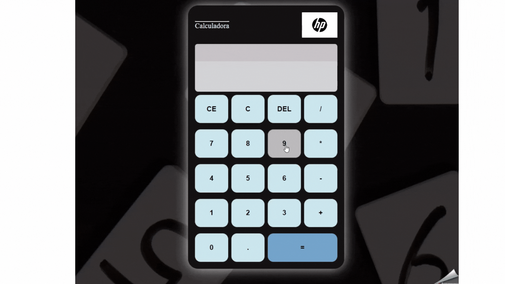

<h1 align="center">

CALCULADORA DIGITAL

</h1>

## 📘 Sobre
<h1></h1>

O projeto **Calculadora Digital** foi elaborado para que eu pudesse trabalhar e praticar os códigos de HTML, CSS e JAVASCRIPT na criação de uma Calculadora. Foi criado uma Calculadora pronto para uso, com as operações de soma, subtração, divisão e multiplicação incluidas para a funcionalidade.    
 
 
 
 

## 🔨 Ferramentas utilizadas

- HTML
- CSS
- JAVASCRIPT

 
 
 

## Objetivo com o projeto:
<h1></h1>

Demonstrar e praticar na criação de uma calculadora os códigos e funções apropriadas. Meu objetivo era aprender novas estruturas com o CSS para montar colunas com espaçamentos, utilizando o CSS Grid Layout. Também foi um objetivo aprender Funções no JavaScript, para que eu pudesse realizar e printar as operações no display da calculadora e que os comandos acionados na calculadora fossem corretamente printado. 

 
 
 

## Aprendizado
<h1></h1>

Obtive uma evolução no manuseio com o HTML e CSS, na criação de uma estruturta com CSS Grid para criação de colunas. Também aprendi a elaborar funções de cálculos de operações no JavaScript e enteder melhor a Lógica dos meus códigos, isso me ajudará no meu crescimento Técnico  

 
 
 
 

 
  
  
  
  
